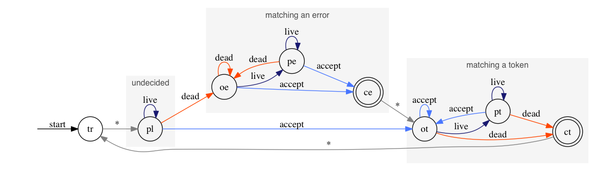

Syntacs Translation Toolkit (STT)
======================================================================


The Syntacs Translation Toolkit (STT) is yet another member of the Yet
Another family of compiler generator tools.  It does:

- Generation of regular-expression-based lexers in Java
- Generation of shift-reduce parsers (SLR1, LALR1, LR1) in Java

The STT has some interesting features:

- Supports 16-bit (Unicode) lexing
- Unique support of lexical states (states are managed with a stack)
- SLR1/LALR1/LR1 DPA construction algorithms (not true, SLR1 is broken)
- Deremer-Penello LALR1 construction algorithm
- Customizable parser error recovery/repair
- Grammars can be written in "syntacs format" (.stt) or XML
- Postscript/PNG visualization of finite automata using "Graphviz"
- Postscript/PNG visualization of pushdown automata using "Graphviz"
- Pretty printing of parse trees
- Highly modular design
- Nice documentation
- GPL License

One unique feature is that an STT grammar file does not contain
semantic actions (no code).  Rather, a separate component is
implemented by the grammar author which is responsible for responding
to lexical and syntactic events to do the actual abstract syntax tree
construction.  Therefore, the STT has a minimalist philosophy of only
trying to automate that which is easily automatable.

Since this is the first release and the generated code is not
"standalone" (requires the STT library to function), I don't recommend
the STT for production work at the current time.  However, since it is
quite modular and has good support visualization of internal
structures, it is immediately useful for educational use and for
algorithm experimentation.

INSTALLATION
----------------------------------------------------------------------

Unpack the distribution archive to a convenient location in your
filesystem.

The syntacs.jar, jenesis.jar, and xerces.jar (or another XML -> DOM
parser) libraries must be known the the java interpreter at runtime
either through the CLASSPATH environment variable or the -classpath
command-line option.

REQUIREMENTS
----------------------------------------------------------------------

JDK1.2+

OPTIONAL/RECOMMENDED TOOLS
----------------------------------------------------------------------

- Graphviz	      http://www.research.att.com/sw/tools/graphviz/
- GhostScript	      http://www.ghostscript.com/
- ImageMagick	      http://www.imagemagick.org/


```
DISTRIBUTION FILES
+---------------------------------------------------------------------
|
|-- README..............This file
|-- CHANGES.............Change Log
|-- LICENSE.............GPL
|-- TODO................Anticipated changes
|-- Makefile............Build file
|
|-- bin.................*Very Simple* shell scripts (/bin/cat them)
|   |-- sttc............STT compiler
|   |-- stti............STT interpreter (execute a single translation)
|   |-- sttt............STT tester (execute a series of tests)
|   `-- dot2png.........GraphViz to PNG converter (req. GraphViz,ImageMagick,Ghostscript)
|
|-- docs
|   |-- api.............Javadocs
|   |-- faq.............FAQ (deplorable)
|   |-- lexerman........A summary of how the lexer works, FYI
|   `-- userman.........User manual
|
|-- etc.................DTDs, other stuff
|
|-- grammar
|   |-- abb.............Example regular expression from Dragon Book (sec. 3.6-)
|   |-- etf.............Example SLR1 grammar 4.11 from Dragon Book
|   |-- slr.............Example LR1/LALR1 grammar 4.20 from Dragon Book
|   |-- scc.............Example LR1/LALR1 grammar 4.21 from Dragon Book
|   |-- regexp..........Internal STT regular expression translator
|   `-- syntacs.........Internal STT native grammar format translator
|
|-- images..............Logo
|
|-- lib
|   |-- syntacs.jar.....Translation Library
|   |-- jenesis.jar.....Sourcecode Generation Subsystem
|   |-- xerces.jar......Xerces 1.2.3 (less *.html.* and *.wml.*)
|   |-- README..........About the libraries
|   `-- APACHE_LICENSE..License for Xerces
|
`-- src.jar.............Sourcecode
```

9-STEP START
----------------------------------------------------------------------

1. Skim the User Manual
2. Skim the Javadocs, especially the org.* packages.
3. Copy one of the sample grammars for skeletal purposes
4. Write the grammar, comment out the
    "compile-interpreter-classname" property
5. Skim the sttc, sttr, sttt scripts.  They are *very* simple.
6. Compile the grammar with sttc
7. Copy one of the LRTranslatorInterpreter implementations and
    recustomize it for your grammar.
8. Recompile grammar with the "compile-interpreter-classname" property.
    The translator is ready to go.
9. Write some tests (see tests.xml files).  Check tests using sttt.


FEEDBACK
----------------------------------------------------------------------

Please report bugs and suggestions to pcj@inxar.org.


